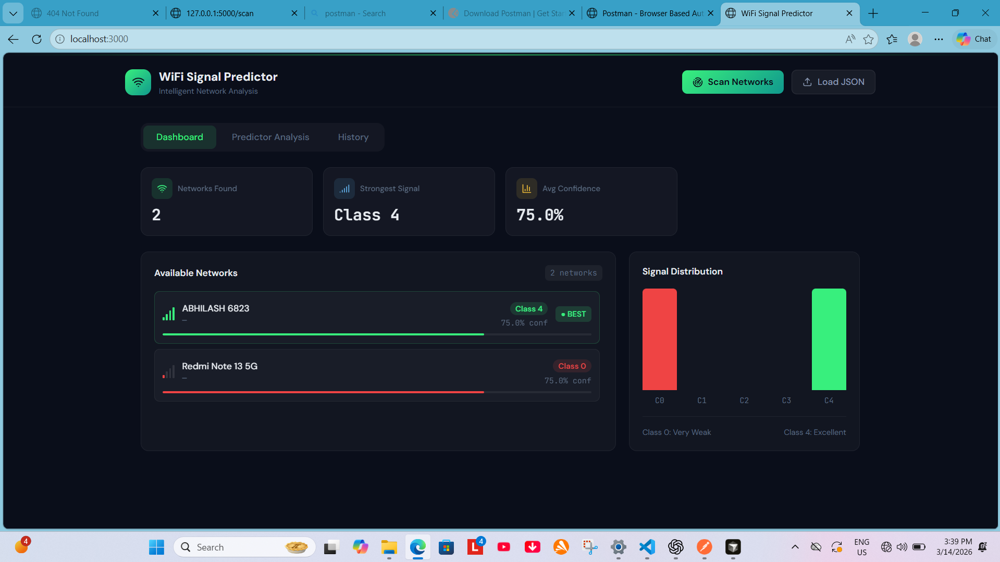
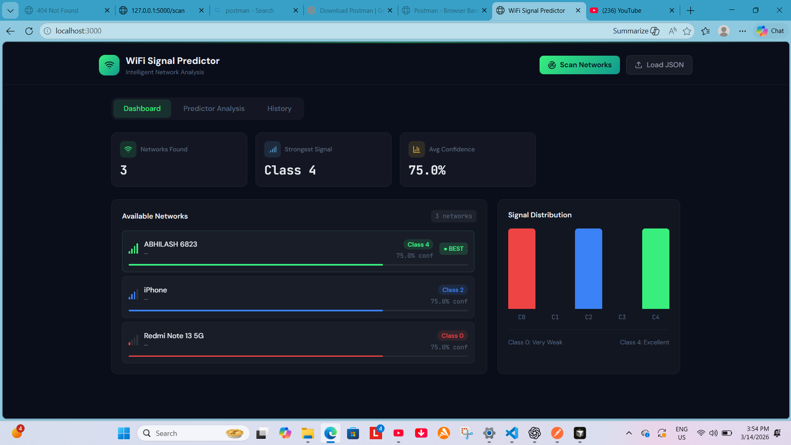

# Netpulse

## Problem Statement
Users often connect to WiFi networks that appear strong but actually deliver poor internet service due to high latency, congestion, or packet loss. Most devices rely mainly on signal strength, which does not accurately reflect the real network performance.

## Solution
This project proposes an ML-based Internet Quality Predictor that analyzes parameters such as latency, download speed, upload speed, packet loss, and signal strength to evaluate overall **internet performance and connection quality**, and suggests the best available network for the user.

## Features
- Predicts overall internet performance and quality
- Uses multiple network parameters for analysis
- Suggests the best available network

## Tech Stack
- Python
- Machine Learning (Scikit-learn)
- Network testing tools (Ping, Speedtest)
- Data analysis (NumPy, Pandas)

- HTML + Vannila JS (FrontEnd)
- Node.js (Website Server)

## Demo Video

🎥 Watch the demo:  
https://drive.google.com/file/d/17VAsICGwY2jkTneJQ4jT3Nsk6xmjoC3V/view?usp=sharing
